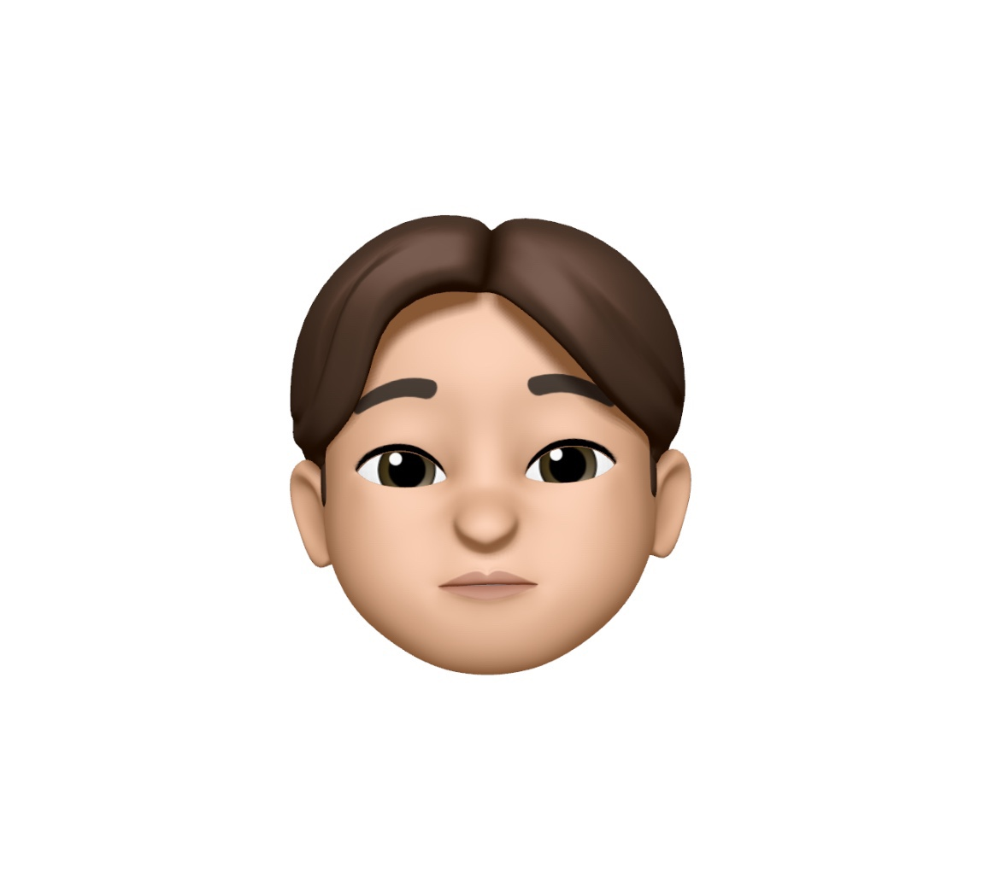

    

# TRIPWHIZ

> 국내에서 원하는 상품을 구매 및 결제한 뒤, 해외 현지 편의점에서 간편하게 픽업할 수 있는 서비스  
> **개발기간:** 2024.10.15 ~ 2024.12.24

---

## 📌주요 기능
- 국내 결제 후 해외 픽업
- 수화물 이동, 보관 서비스
- 챗봇

---

## 🚀Skills

 

 

 

 

---

## 🛠Team

| Image       | Name   | Role        | GitHub                                   |
|-------------|--------|-------------|------------------------------------------|
|  | 박주희    | Team Leader | [GitHub Profile](https://github.com/eggzuxi)       |
|  | 차민주    | Full Stack  | [GitHub Profile](https://github.com/backgoon0903) |
|  | 박신영    | Full Stack  | [GitHub Profile](https://github.com/ssinyong)     |
|  | 진성오    | Full Stack  | [GitHub Profile](https://github.com/jin-sung-oh)  |
|  | 최설아    | Full Stack  | [GitHub Profile](https://github.com/Seola-CHOE)   |
